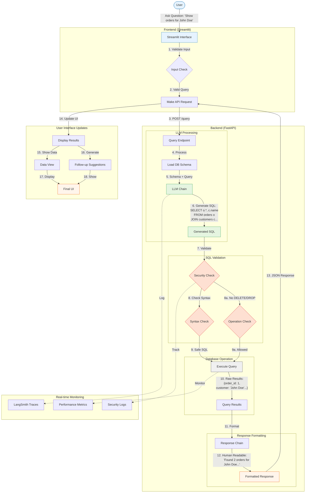
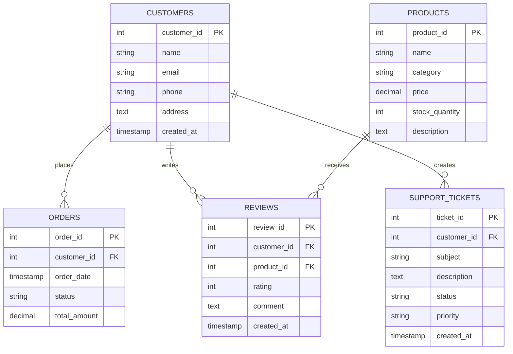
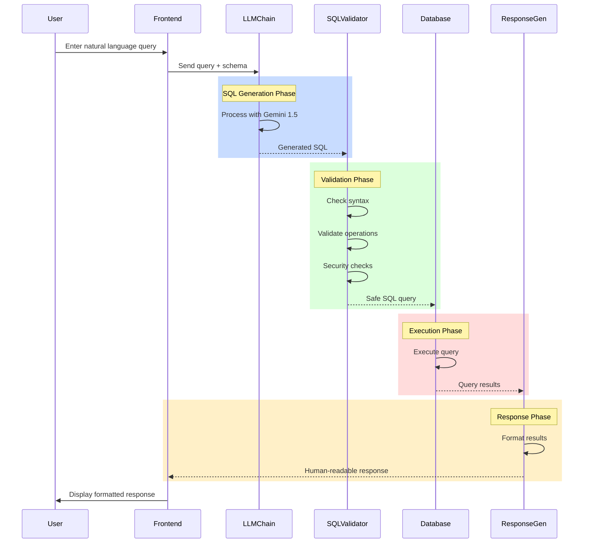

# E-commerce SQL Agent with Natural Language Interface

A powerful natural language to SQL conversion system that allows customer service agents to query an e-commerce database using plain English. Built with FastAPI, Streamlit, LangChain, and Google's Gemini 1.5 Flash.

## 🌟 Features

- **Natural Language Queries**: Convert English questions to SQL queries
- **Smart Response Formatting**: Human-readable responses with relevant details
- **Real-time Processing**: Instant query execution and response
- **Comprehensive Monitoring**: LangSmith integration for observability
- **User-friendly Interface**: Modern Streamlit frontend
- **Secure SQL Generation**: Validation and safety checks
- **Error Handling**: Robust error management with retries
- **Performance Tracking**: Query statistics and monitoring

## 📁 Project Structure

```
RAG_VS_SQL_Agent_Comparison_Analysis/
├── backend/                 # FastAPI Backend
│   ├── llm_chain.py        # LangChain integration
│   ├── main.py            # FastAPI application
│   ├── models.py          # Data models
│   ├── postgres.py        # Database utilities
│   ├── sql_agent.py       # SQL generation agent
│   └── sql_validator.py   # Query validation
├── database/               # Database Setup
│   ├── sample_data.sql    # Sample e-commerce data
│   ├── schema.sql         # Database schema
│   └── setup_db.py        # Database initialization
├── frontend/              # Streamlit Frontend
│   ├── app.py            # Main Streamlit app
│   └── utils.py          # Frontend utilities
├── requirements.txt       # Python dependencies
└── run_app.py            # Application runner
```

## 📊 System Architecture

### Query Processing Flow


### Step-by-Step Query Flow Explanation

1. **User Input** (Steps 1-2)
   - User enters natural language question
   - Frontend validates input format and length
   - Query is prepared for API submission

2. **LLM Processing** (Steps 3-6)
   - Backend receives query via API endpoint
   - Database schema is loaded for context
   - LLM chain processes query with schema
   - SQL query is generated with proper JOINs and conditions

3. **Query Validation** (Steps 7-8)
   - Security checks for prohibited operations
   - SQL syntax validation
   - Operation type verification (SELECT only)
   - Input sanitization

4. **Database Operation** (Steps 9-10)
   - Validated SQL is executed
   - Results are fetched from database
   - Raw data is prepared for formatting

5. **Response Generation** (Steps 11-12)
   - Raw results passed to LLM chain
   - Human-readable response generated
   - Formatting applied for readability

6. **UI Updates** (Steps 13-18)
   - Response sent back to frontend
   - Results displayed in formatted view
   - Follow-up suggestions generated
   - Final UI updated with all components

7. **Continuous Monitoring**
   - LangSmith traces recorded
   - Performance metrics tracked
   - Security events logged
   - System health monitored

### Database Schema


### Query Processing Flow


### Key Components Explained

1. **Frontend Flow (Streamlit)**
   - Accepts natural language queries
   - Validates input
   - Makes API calls to backend
   - Displays formatted results
   - Shows follow-up suggestions

2. **Backend Pipeline (FastAPI)**
   - API endpoint handling
   - SQL generation via LLM
   - Query validation and security
   - Database interaction
   - Response formatting

3. **Database Structure**
   - Customers table for user data
   - Products catalog
   - Orders tracking
   - Customer reviews
   - Support ticket management

4. **Monitoring & Tracing**
   - LangSmith integration for LLM monitoring
   - Application logging
   - Performance metrics tracking
   - Error monitoring

## 🚀 Quick Start

1. **Clone the Repository**
   ```bash
   git clone <repository-url>
   cd RAG_VS_SQL_Agent_Comparison_Analysis
   ```

2. **Set Up Virtual Environment**
   ```bash
   python -m venv venv
   source venv/bin/activate  # On Windows: venv\Scripts\activate
   pip install -r requirements.txt
   ```

3. **Configure Environment Variables**
   Create a `.env` file in the project root:
   ```env
   # Database Configuration
   DB_HOST=localhost
   DB_PORT=5432
   DB_NAME=ecommerce_db
   DB_USER=postgres
   DB_PASSWORD=your_password

   # Google Gemini API
   GOOGLE_API_KEY=your_gemini_api_key
   GEMINI_MODEL=gemini-1.5-flash
   GEMINI_TEMPERATURE=0.1
   GEMINI_MAX_TOKENS=2048

   # LangSmith Configuration
   LANGSMITH_TRACING_V2=true
   LANGSMITH_API_KEY=your_langsmith_api_key
   LANGSMITH_PROJECT=W5D5_Q1_SQL_AGENT
   LANGSMITH_ENDPOINT=https://api.smith.langchain.com

   # Application Settings
   APP_DEBUG=true
   LOG_LEVEL=INFO
   ENVIRONMENT=development
   BACKEND_HOST=0.0.0.0
   BACKEND_PORT=8000
   FRONTEND_PORT=8501
   ```

4. **Initialize Database**
   ```bash
   # Start PostgreSQL service
   # Create database and user according to your .env configuration
   python database/setup_db.py
   ```

5. **Start the Application**
   ```bash
   # Terminal 1: Start Backend
   python backend/main.py

   # Terminal 2: Start Frontend
   cd frontend
   streamlit run app.py
   ```

6. **Access the Application**
   - Frontend: http://localhost:8501
   - Backend API: http://localhost:8000
   - API Documentation: http://localhost:8000/docs

## 💡 Usage Examples

1. **Find Customer Orders**
   ```
   "Show all orders for John Doe"
   ```

2. **Check Recent Orders**
   ```
   "List all orders from this month"
   ```

3. **Product Reviews**
   ```
   "Show reviews for Wireless Bluetooth Mouse"
   ```

4. **Support Tickets**
   ```
   "List all high priority support tickets"
   ```

## 🔍 Monitoring & Debugging

### LangSmith Integration
- Access traces at: https://smith.langchain.com
- Monitor:
  - SQL generation accuracy
  - Response formatting
  - Error patterns
  - Performance metrics

### Debug Endpoints
- `/health`: System status check
- `/stats`: Usage statistics
- `/debug/test-db`: Database connection test
- `/debug/test-llm`: LLM chain test

## 🛠️ Development

### Running in Debug Mode
```bash
# Backend
python -m debugpy --listen 5678 --wait-for-client main.py

# Frontend
python -m debugpy --listen 5679 --wait-for-client app.py
```

### Adding Breakpoints
1. In code:
   ```python
   breakpoint()
   ```
2. In VS Code:
   - Click left margin of code line
   - Or use F9 on selected line

## 📊 Database Schema

The e-commerce database includes:
- `customers`: Customer information
- `products`: Product catalog
- `orders`: Customer orders
- `reviews`: Product reviews
- `support_tickets`: Customer support requests

See `database/schema.sql` for complete schema details.

## 🔒 Security

- SQL Injection Prevention
- Query Validation
- Rate Limiting
- CORS Protection
- Error Sanitization

## 🤝 Contributing

1. Fork the repository
2. Create a feature branch
3. Commit your changes
4. Push to the branch
5. Create a Pull Request

## 📝 License

This project is licensed under the MIT License - see the LICENSE file for details.

## 🙏 Acknowledgments

- LangChain for the amazing framework
- Google for Gemini API
- FastAPI and Streamlit teams
- PostgreSQL community
